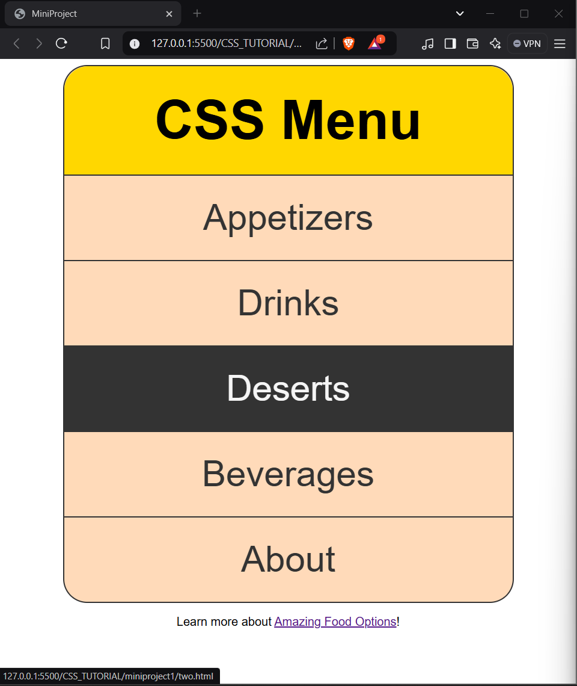

# WebD_miniproject1
A mini practice projects for WebD concepts.
# MiniProject: CSS Navigation Menu

## Project Image

## Overview

This mini project demonstrates the creation of a simple, stylish navigation menu using HTML and CSS. It provides an easy-to-follow example of how to design a navigation bar with links that change appearance when hovered or focused on. The project features a centered navigation menu with hover effects, borders, and a modern design layout.

## Features

- **Responsive Design**: The menu adapts to different screen sizes by using flexible styling techniques.
- **Custom Styles**: The menu is styled with colors like peachpuff and gold, along with text and hover effects.
- **Hover Effects**: Links in the navigation menu change color and background when hovered over.
- **External Link**: The "Amazing Food Options" link directs users to a restaurant listing page on Zomato.
